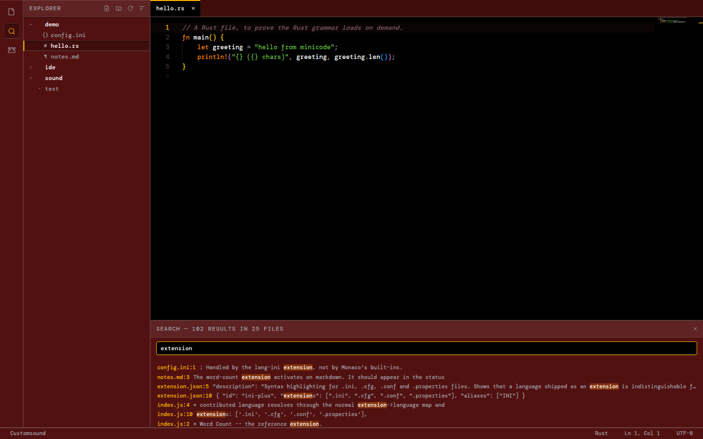

# MiniCode

A VS Code–style IDE in about **3.3 MB** of frontend: a real file-management UI,
Monaco (the actual VS Code editor), ~88 languages, and a full extension host —
inside a Tauri desktop shell rather than Electron.



## Why it is small

Monaco is the biggest thing in the build, and most projects ship all of it. The
savings here come from four decisions:

| Decision | Saved |
|---|---|
| Import `editor.api`, not the `monaco-editor` barrel | drops every language service |
| Use `basic-languages/monaco.contribution`, **not** `languages/register.all` | the latter also pulls the css/html/json/ts services — ~8 MB |
| Ship only `editor.worker`; no css/html/json workers | ~2.2 MB, plus a 140 KB icon font |
| TypeScript IntelliSense is opt-in at *build* time | 6.6 MB |

Each of the ~88 grammars is its own chunk, reached only through the dynamic
`loader` in its registration. Opening a `.rs` file fetches the Rust grammar
(~9 KB) and nothing else.

```
base (loaded at startup)      2.97 MB     809 KB gzipped
lazy (fetched on demand)      381 KB      88 grammar chunks, 4.3 KB average
total on disk                 3.34 MB
```

Run `npm run size` after a build for the current numbers.

Adding the Tauri binary (`opt-level="z"`, LTO, `panic="abort"`, stripped)
puts a typical install around **9–11 MB** — against roughly 250 MB for the same
app on Electron. That figure comes from the release profile rather than a
measured build; see *Building the desktop app* below.

## Features

**Files** — folder open, lazy-expanded tree, new file/folder, rename, duplicate,
delete, drag-and-drop move, context menu, copy path.
**Editing** — multi-tab with dirty indicators, per-file undo/cursor/scroll state,
save (`Ctrl+S`), save-all, unsaved-changes prompts, Monaco's find/replace.
**Navigation** — `Ctrl+P` fuzzy quick open, `Ctrl+Shift+P` command palette,
`Ctrl+Shift+F` find in files.
**Session** — the open folder and tabs come back on relaunch.

| Key | Action |
|---|---|
| `Ctrl+P` / `Ctrl+Shift+P` | Go to file / Command palette |
| `Ctrl+Shift+F` | Search in files |
| `Ctrl+S` / `Ctrl+Shift+S` | Save / Save all |
| `Ctrl+N` / `Ctrl+W` | New file / Close editor |
| `Ctrl+B` | Toggle sidebar |
| `Ctrl+Tab` / `Ctrl+Shift+Tab` | Next / previous editor |
| `F2` / `Del` | Rename / delete (in the tree) |

## Running it

```bash
cd ide
npm install
npm run dev          # http://localhost:5173, workspace = the repo root
```

Set `MINICODE_ROOT=/some/path` to open a different folder in the browser.

```bash
npm run build        # default: no TypeScript service
npm run build:full   # + TypeScript IntelliSense (adds ~8 MB)
npm run size         # size report for whatever is in dist/
npm run preview      # serve the built output, with the same fs backend
```

The frontend runs in a plain browser because `src/core/fsapi.js` picks its
backend at load time: Tauri's `invoke` when running in the app, and a small
HTTP middleware (defined in `vite.config.js`, never bundled) when running in
vite. Nothing else in the app knows which is live.

### Building the desktop app

```bash
npm run tauri build
```

Needs a Rust toolchain plus the platform webview headers — on Debian/Ubuntu
`libwebkit2gtk-4.1-dev`, `libgtk-3-dev`, `libayatana-appindicator3-dev`,
`librsvg2-dev`, `build-essential`. macOS needs Xcode command line tools;
Windows needs the WebView2 runtime and MSVC build tools.

> The Rust backend has not been compiled in this repo's development container,
> which has no webkit2gtk. Its path-guard logic is covered by `cargo test`
> (5 tests, all passing); the Tauri wiring itself is first exercised by the
> command above.

```bash
cd src-tauri && cargo test    # the path guard
```

## Extensions

An extension is a directory with an `extension.json` and one JS module.
Contributions are registered eagerly (they are only declarations); the module
itself is imported the first time an activation event fires.

```json
{
  "id": "word-count",
  "name": "Word Count",
  "version": "1.0.0",
  "main": "index.js",
  "activationEvents": ["onLanguage:markdown", "onCommand:wordCount.showDetails"],
  "contributes": {
    "commands": [{ "command": "wordCount.showDetails", "title": "Word Count: Show Details" }],
    "keybindings": [{ "key": "ctrl+alt+w", "command": "wordCount.showDetails" }]
  }
}
```

```js
export function activate(ide, context) {
  const item = ide.window.createStatusBarItem({ align: 'left' });
  item.text = 'ready';
  context.subscriptions.push(item);
}
export function deactivate() {}
```

**Activation events:** `onStartup`, `onCommand:<id>`, `onLanguage:<id>`,
`workspaceContains:<file>`, `*`.

**API** (everything returns a disposable, collected on `context.subscriptions`):

| Namespace | Surface |
|---|---|
| `ide.commands` | `register(id, fn, meta)`, `execute(id, ...args)` |
| `ide.keybindings` | `bind(chord, commandId)` |
| `ide.window` | `showMessage`, `showInputBox`, `showQuickPick`, `createPanel`, `createStatusBarItem` |
| `ide.workspace` | `rootPath`, `fs.*`, `onDidSaveDocument`, `onDidOpenDocument`, `onDidChangeActiveDocument` |
| `ide.editor` | `activePath`, `getText`, `setText`, `insert`, `selection`, `save`, `monaco` |
| `ide.languages` | `register({id, extensions, grammar, configuration})`, `registerCompletionProvider`, `registerHoverProvider`, `registerWorker` |
| `ide.themes` | `register(name, { monaco, tokens })`, `apply(name)` |
| `ide.storage` | `get(key, fallback)`, `set(key, value)` — namespaced per extension |

A theme's `tokens` overrides the CSS custom properties the chrome is built
from, so one contribution restyles the whole app rather than just the code area.

### Installing one

Drop a directory into `~/.minicode/extensions/`. User extensions are read off
disk and evaluated from a blob URL, so each must be a **single self-contained
file** — relative imports cannot resolve.

### The bundled examples

- **`extensions/word-count`** — status bar item, command, keybinding, panel.
- **`extensions/lang-ini`** — a whole language in ~40 lines: Monarch grammar plus
  language config. Contributed languages resolve through the normal
  extension→language map and appear in *Change Language Mode* alongside built-ins.
- **`extensions/theme-classic-dark`** — restyles Monaco *and* the chrome.
- **`extensions-optional/lang-typescript-ide`** — the interesting one. Monaco's
  TypeScript service is larger than everything else here combined, so it is not
  compiled in unless you build with `MINICODE_OPTIONAL=1`. It claims Monaco's
  worker labels via `ide.languages.registerWorker`, which is how a heavyweight
  language service stays out of a small default install.

## Design

The interface follows *System Interface — Skeuomorphic Clean*: black ground,
`#521111` surfaces, amber/orange actions, DM Mono throughout with Instrument
Serif for body copy, and tight 2px/4px radii. Panes are discrete plates with a
lit top edge and a cast shadow; inputs are inset, buttons and tabs raised. No
gradients — *clean* is the operative half.

`src/tokens.css` holds the tokens; nothing else hard-codes a colour, radius or
font. Syntax colours come from the source's own Spectrum Chroma ramp, the same
ramp the chrome uses, so the code area reads as part of the system rather than
an editor dropped into it.

The spec's ambient WebGL layer is deliberately **not** implemented: a background
render loop costs both megabytes and battery in a text editor.

Fonts are self-hosted (latin subset only, 35 KB for both) so the app works
offline and makes no request to Google.

## Layout

```
ide/
  src/
    main.js          bootstrap, core commands, keybindings, session
    tokens.css       the design tokens
    style.css        chrome, built only from tokens
    core/
      fsapi.js       the one fs interface; Tauri or dev backend
      editor.js      Monaco instance, model cache, worker registry
      langs.js       extension -> language, lazy grammar loading
      theme.js       Skeuomorphic Clean, for Monaco and the chrome
      explorer.js    the file tree and all CRUD
      tabs.js        tab strip, dirty state, close gate
      extensions.js  discovery, contributions, activation
      api.js         the `ide` object handed to extensions
      commands.js keymap.js ui.js panel.js search.js quickopen.js
      statusbar.js events.js icons.js
  extensions/          bundled
  extensions-optional/ compiled in only with MINICODE_OPTIONAL=1
  src-tauri/           Rust backend: fs commands behind one path guard
  scripts/             size.js, fonts.js, icon.js
```

Every filesystem path from the frontend is resolved through one guard
(`resolve_within` in `src-tauri/src/main.rs`) that rejects both `..` escapes and
symlinks pointing out of the workspace. `tauri-plugin-fs` is deliberately unused
— hand-rolled commands are smaller and keep that check in a single place.
